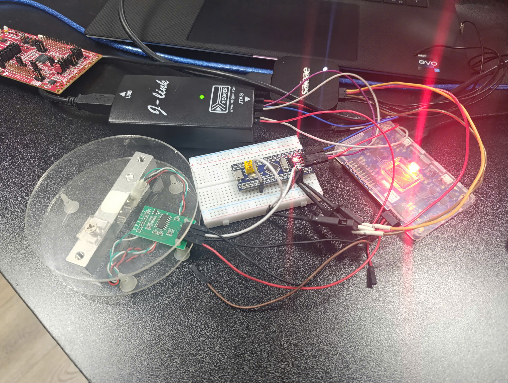
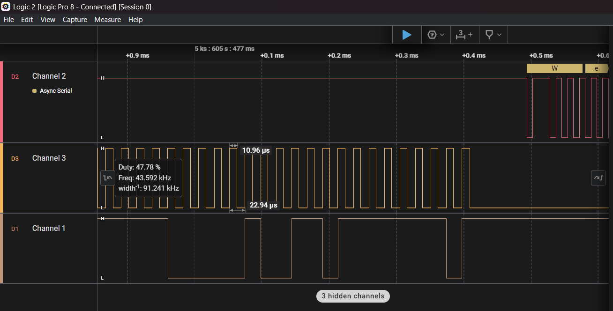
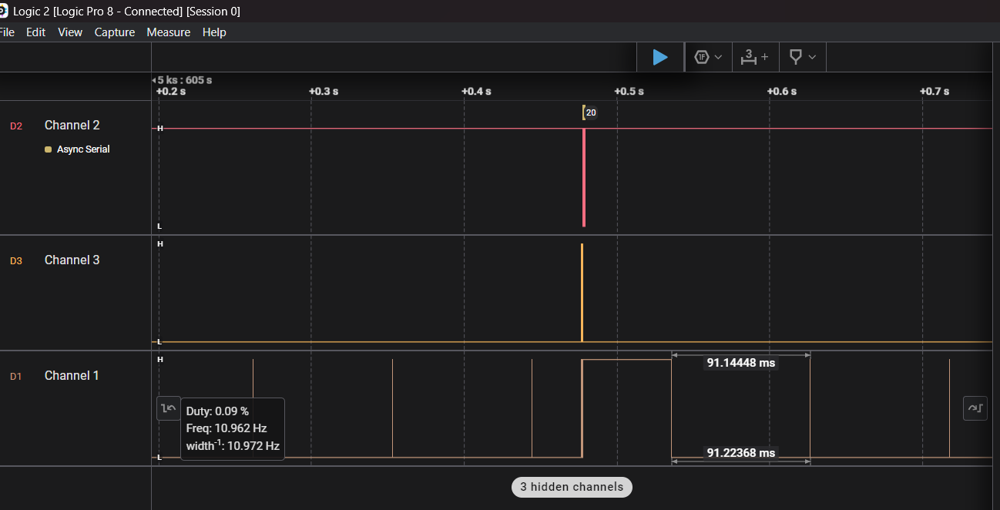
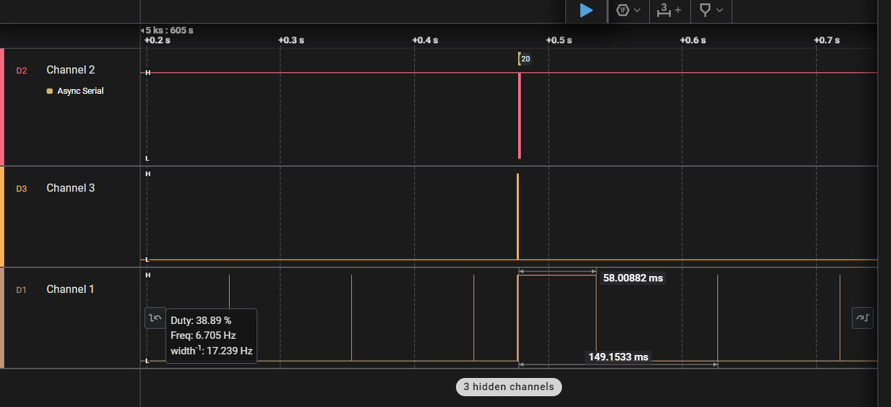
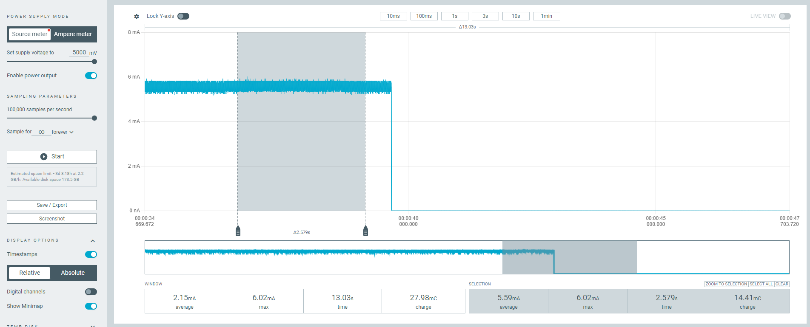
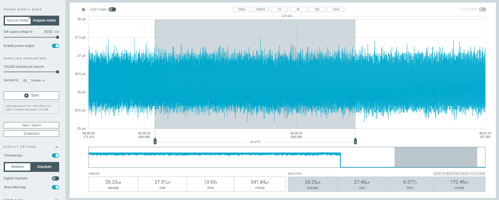

# HX711 Load Cell Amplifier C Driver

## Overview
The **HX711** is a precision 24-bit analog-to-digital converter (ADC) designed for weigh scales and industrial control applications. This C driver enables communication with the HX711 module using a microcontroller over a **digital interface**. The communication is achieved via a two-wire protocol (DATA and CLOCK).

Currently, the example only supports STM32F103. Feel free to contact me if you need assistance or wish to develop additional features.

## Features
- Interface with **load cells** for weight measurement.
- High precision 24-bit ADC.

## Hardware Requirements
- **Microcontroller** (e.g., STM32, AVR, ESP32, etc.)
- **HX711 Load Cell Amplifier module**
- **2 GPIO pins** for DATA and CLOCK signals

## Example
*Note:* Currently supports an STM32 example, tested on STM32F103C8T6.
The example reads the load cell value and prints it out through UART.

- example\stm32\calib_find_ref_weight_value: it is there if the user want to calibrate the scale instead of using author's default values
- example\stm32\basic_read_weight: auto tare, print out the result through uart

## Used Peripherals:
- GPIO: for read/clock out data from hx711
- TIMER: to make a delay function
- UART: print out results
- Utils:
  - float to string conversion

## Wiring Diagram
For example STM32F103C6T6,
you can find the information in `inc/board_config.h`
or below:

| HX711 Pin   | MCU Pin  |
| ----------- | -------- |
| VCC         | 3.3 - 5V |
| GND         | GND      |
| DT (DATA)   | GPIO_B8  |
| SCK (CLOCK) | GPIO_B9  |
-------------------------
| UART (TX)   | GPIO_A9  |


## Installation
1. **Copy driver files** (`hx711.c`, `hx711.h`) into your project.
2. **Include the header file** in your source code:
    ```c
    #include "hx711.h"
    ```

## Usage

### (Optional - referably) Calibration
1. Find the example `calib_find_ref_weight_value`, build and flash the firmware to mcu
   - cd ./example/stm32/calib_find_ref_weight_value
   - make clean
   - make
    Flash the `./build/calib.elf' to your mcu
2. Observes the output throught UART:
i.e.
```c
[Calib] object weight: 188(g) | ref value: 7873649
[Calib] object weight: 188(g) | ref value: 7877023
[Calib] object weight: 188(g) | ref value: 7873680
[Calib] object weight: 188(g) | ref value: 7873692
[Calib] object weight: 188(g) | ref value: 7873630
[Calib] object weight: 188(g) | ref value: 7873643
[Calib] object weight: 188(g) | ref value: 7873606
[Calib] object weight: 188(g) | ref value: 7873635
```
3. Note down your value (i.e 188, 7873635)
4. Find the example `calib_find_ref_weight_value`, build and flash the firmware to mcu
   - back to project directory 
   - cd ./example/stm32/basic_read_weight
   - Find main.c and init it with your ref values
```c
   hx711_init(HX711_GAIN_128, true, 188, 7873635);
```
   - make clean
   - make
    Flash the `./build/hx711_loadcell.elf' to your mcu

5. Observe the output:
```c
Weight: 0.16016(g) // when not place anything
Weight: 0.14063(g)
Weight: -597.15234(g) // communication error
Weight: 0.36914(g)
Weight: 0.33789(g)
Weight: 0.29883(g)
Weight: 0.24609(g)
Weight: 206.10937(g) // when I put my phone one the scale
Weight: 206.19531(g)
Weight: 206.07421(g)
Weight: 206.22070(g)
Weight: 206.08007(g)
Weight: 206.03710(g)
Weight: 206.13476(g)
Weight: 207.04101(g)
Weight: 0.14844(g) // when I took it out
Weight: 0.12891(g)
Weight: 0.18359(g)
Weight: 0.32227(g)
```

### Initialize hardware abstraction for HX711
```c
void hx711_com_init(void)
{
    hx711_hw_ops_t hx711_ops = {
            .read = hal_gpio_read,
            .write = hal_gpio_write,
            .delay_us = hal_delay_us,
    };
    hx711_set_hw_ops(&hx711_ops);
}

int32_t hx711_get_weight(void)
{
        return hx711_read();
}

...
```

### Initialize MCU hardware
```c
    HAL_Init();
    SystemClock_Config();
    MX_GPIO_Init();
    MX_USART1_UART_Init();
    hx711_com_init();
```

### Read Weight Data
```c
        sw_udelay(1000000);

        int32_t weight = hx711_get_weight();
        hal_uart_printf("Weight: %d\n", weight);
        HAL_GPIO_TogglePin(BUILTIN_LED_PORT, BUILTIN_LED_PIN);
```

### Results:
*I used logic analyzer to print out values*

```c
Weight: 0.16016(g) // when not place anything
Weight: 0.14063(g)
Weight: -597.15234(g) // communication error
Weight: 0.36914(g)
Weight: 0.33789(g)
Weight: 0.29883(g)
Weight: 0.24609(g)
Weight: 206.10937(g) // when I put my phone one the scale
Weight: 206.19531(g)
Weight: 206.07421(g)
Weight: 206.22070(g)
Weight: 206.08007(g)
Weight: 206.03710(g)
Weight: 206.13476(g)
Weight: 207.04101(g)
Weight: 0.14844(g) // when I took it out
Weight: 0.12891(g)
Weight: 0.18359(g)
Weight: 0.32227(g)
```

## Notes
- HX711 operates at **5V** but can also work at **3.3V** with reduced performance.

## Performance evaluation:

Here is my setup:


1. Clock timing:
   As I set each clock is 10us using stm32f103c6t6 timer, by using salae logic analyzer, I'm able to measure 
   each clock bit is ~10us to 12us.
   

2. Sampling rate:
    I set the sampling rate to be 10Hz, the result is ~10Hz with the data measuring time less than 100ms (~60ms):
    
    

3. Accuracy:
   The accuracy is depended on the calibration, here I just want to evaluation the noise, which causes err of +-0.1g
```c
Weight: -1.08594(g)
Weight: -1.00781(g)
Weight: -1.09570(g)
Weight: -1.05859(g)
Weight: -1.10156(g)
Weight: -1.11328(g)
Weight: -1.08203(g)
Weight: -1.06445(g)
Weight: -1.11719(g)
Weight: -1.15430(g)
Weight: -1.18359(g)
Weight: -1.11523(g)
Weight: -1.05664(g)
Weight: -1.11133(g)
Weight: -1.10547(g)
Weight: -1.09375(g)
Weight: -1.18945(g)
Weight: -1.08984(g)
```

## Power Consumption Evaluation
- Measurement device: Nordic PPK2
- Condition: Input supply to VCC (main power source)
- Result: 5.5mA @ 5V when up
          26.23uA @ 5V when down





## License
This driver is open-source and can be used freely in any project.

---

**Author:** Binh Pham  
**Contact me**: You can find my contact @ https://github.com/ch-binh  
**Version:** 1.0  
**Last Updated:** March 2025

